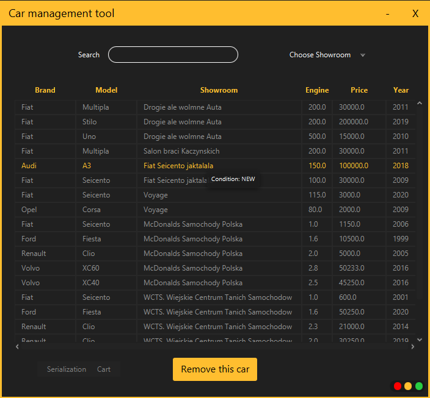

# Car showroom management app

**Created:** 7.12.2020, **last update:** 6.01.2021

### Goals:

1. Improve OOP skills
2. Learn how to build an app with JavaFX framework
3. Learn how to use MVC design pattern in practice
4. Use css to beautify the application

### Description

This is the second project built in Java, after diving in basics in [java-algorithms](https://github.com/gregwell/java-algorithms).

The app allows you to:

1. List cars in different car showrooms.
2. Select and remove individual cars.
3. Import and export the list of all vehicles from one or more showrooms from a .csv file
4. Add to cart and import or export selected cars.
5. Change the visuals by choosing red, yellow or green color in the lower right corner of the window.

### External notes:

- [link to project notes](https://github.com/gregwell/university-notes/blob/main/english/java/javafx-notes.md)

### The structure of MVC project:

- **Main.java -** defines the view part of MVC model
- **ui.fxml -** defines project structure, and creates the reference for a controller to see the **fx:id** of the component
- **styles.css -** all visuals of the fxml project
- **Controller.java -** this class implements **Initializable** and has to override initialize() method.

### Screenshots:

